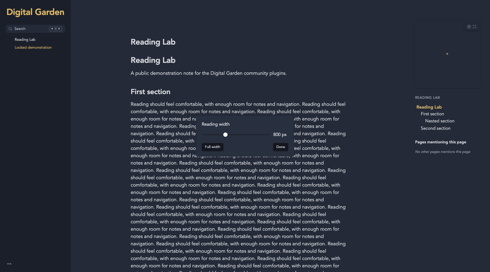

# Resizable Panes & Reading Width

Accessible side-pane resizing, reversible collapse and a live, centered reading-width control.

## Installation

In Obsidian: Settings > Digital Garden > Plugins > Manage plugins > Browse & install. Until listed in the community gallery, use Install from GitHub with `koltensaccount/garden-plugin-resizable-panes`. A garden with current plugin support is required. Installation is file copying only; no setup scripts or dependencies need to run on the garden. Save settings and let the site rebuild.

## Usage

Side panes support mouse, touch and keyboard arrows (Shift for larger steps). Drag to the minimum to collapse; reverse while holding to reopen. Reading width offers 480-1440px plus Full/reset and is clipped to available screen space. Preferred widths are saved separately from temporary viewport limits. Canvas layouts are excluded; the native right-hand bottom sheet is not resized.

Pane resizing and custom page geometry apply above 1400px. At 1400px and below, both pane handles hand layout back to Digital Garden; its page-panel toggle, backdrop and bottom sheet remain native. Saved pane widths/collapse choices return on desktop. The right page panel can contain backlinks, graph or plugin content without a TOC. Resizable Panes owns pane geometry; TOC Settings owns TOC-specific presentation and buffer spacing.

## Settings

| Key | Setting | Default |
| --- | --- | --- |
| `enabled` | Enable resizable panes | true |
| `defaultLeftWidth` | Default left pane width | 260 |
| `defaultRightWidth` | Default right pane width | 300 |
| `minPaneWidth` | Minimum pane width | 200 |
| `maxViewportPercent` | Maximum pane viewport percent | 40 |
| `mainMinWidth` | Minimum content width | 560 |
| `paneGap` | Content gap | 24 |
| `persistWidths` | Remember resized widths | true |

## Compatibility and Accessibility

Works alone and with the other reading plugins. Shared footer controls use the neutral `dg-nav-tools` convention, with a floating fallback when navigation is absent. Each plugin ships the helper it needs; none imports another plugin. Current Digital Garden uses full-document navigation. Initialization is idempotent. Native controls, accessible labels, focus outlines and appropriate ARIA states are retained. Print styles remain separate from screen preferences. Browser storage failures fall back safely.

## Development

Node 22+; `npm ci`, `npm run check`, `npm test`. Tests use Node's test runner and Playwright's driver with an installed Chrome/Edge browser (`CHROME_PATH` overrides discovery). CI uses Ubuntu's Chrome. Browser tests never invoke an OS print dialog. The plugin files are ready to copy directly into `src/plugins/resizable-panes/` in a current test garden. Real upstream integration and combination checks are reported in `VALIDATION.md`.

## License

MIT, copyright 2026 Kolten Bendickson.
